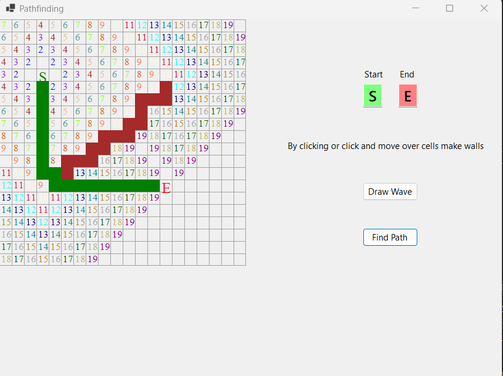

# Windows Froms - Encrypt and Decrypt application

 

• Small application where you choose start and ending
• You can add walls through which the path can't go
 
• It's a visual representation of the Dijkstra's algorithm

## 

  

## Built With

